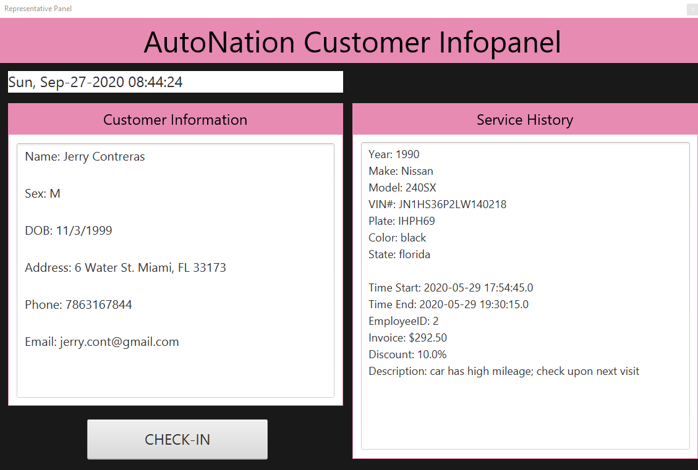

<p align=center></p>
<h1 align=center>p y V I S I O N</h1>
<h5 align=center>A Cloud-Native Infrastructure for License Plate Recognition and Text Extraction with Python Integration</h5>

## About The Project
The inspiration of this project stemmed from the passion of leveraging emerging technologies such as Machine Learning and Artificial Intelligence in real world applications. As such, a use case was explored where a cloud-based infrastructure on the Google Cloud Platform could be integrated at AutoNation to provide a personalized customer experience specifically in the service center department by extracting the text from the license plate of a car and retrieving relevant customer information from a database using the value of the license plate as a lookup criteria. Key information such as scheduled appointments, reason for visit, and customer contact information could be used by a service advisor at AutoNation to speed-up the check-in process and promote a high-quality customer-centric environment.

#### Future Work and Relevancy
This project has the potential to further expand on the existing cloud infrastructure to intelligently automate status updates, appointments, document signing, customer checkout, car inspections, and rating or reviews of service. Additionally, given the current situation regarding the COVID-19 pandemic, a health aspect can be incorporated to notify customers of high density hours, reminders to social distance, locations of sanitizing stations across the AutoNation facility, and the ability to expedite/delay appointments in intervals (i.e., 15 min, 30 min, 1 hour) in response to high or low activity at a given location.

<p align=center></p>

Our Database design and modeling (schema) is depicted below for reference

<p align=center></p>

To view the end goal and the holistic approach of our project, please preview the demo below

<p align=center></p>

An example of the constructed GUI prepopulated with information from the cloud infrastructure is displayed below

<p align=center></p>


#### Technologies and Software Used:
* Google Cloud Platform (GCP)
* SQL Server & SQL Server Management Studio
* Python 3.8 (on Anaconda)
* JavaFX 8.5 (on IntelliJ IDEA)
* Java 8 (on IntelliJ IDEA)
* (Optional) SceneBuilder (for UI development purposes only)
* (Optional) Blender; for video demo and animation purposes only

## Getting Started
1. Ensure that the Google Cloud SDK is installed and configured properly.
  - A. Follow the instructions and documentation located [here](https://cloud.google.com/sdk/docs/install).


2. Ensure that the Google Cloud SQL Proxy is installed and configured properly.
  - A. Follow the instructions and documentation located [here](https://cloud.google.com/sql/docs/mysql/sql-proxy).


3. Ensure that a recent version of Python is installed (i.e., > 3.5).

4. (Recommended) Ensure that an IDE of your preference is installed for running the source code as opposed to terminal executions. The utilized technologies are listed in the above section.

4. (Optional) Install JavaFX, Java, and SceneBuilder (for displaying UI).

## Prerequisites and Installation
To download a copy of this project's source code, do a `git clone` in a terminal window as follows:

```sh
git clone https://github.com/eitanflor/ShellHacks-2020.git
```

## Example Usage
A large portion of the functionality resides in the cloud, as such, it is suggested to replicate the cloud infrastructure as depicted in the above [diagram](docs/diagrams/pyVision_Cloud_Infrastructure.svg). As an alternative, the python portion of our implementation is independent and will process and return the extracted License Plate text from an image, this can be done in the following steps:

1. Open [API_utils.py](visionAPI/api_utils.py) and change the location path to your native Google Secret Key file as declared in

```py
os.environ['GOOGLE_APPLICATION_CREDENTIALS']='path/to/your/key/file.json'
```

2. Run the function below in order to extract the text from a local image of a license plate.

```py
extract_license_plate(YOUR_LOCAL_IMAGE_PATH)
```

3. Run the function below in order to save and export the results of the text extraction into a `.txt` file on Google Storage.

```py
save_to_cloud(YOUR_GOOGLE_STORAGE_BUCKET_NAME, YOUR_LOCAL_FILENAME, YOUR_DESTINATION_FILENAME)
```

4. To view the UI that is automatically populated with information from the cloud infrastructure, ensure that only the [gui](gui) folder is imported a project into your
preferred IDE for Java. Customize the configurations as seen below for proper functionality.
- A.
```java
public void sql_Start(String plate)
                    "jdbc:sqlserver://YOUR_SERVER_NAME:PORTNUMBER;"
                            + "database=YOUR_DATABASE_NAME;"
                            + "user=YOUR_USER_NAME;"
                            + "password=YOUR_PASSWORD;";
```
- B.
```java
String PATH_TO_JSON_KEY = "path/to/your/key/file.json";
        String BUCKET_NAME = "YOUR_GOOGLE_STORAGE_BUCKET_NAME";
        String OBJECT_NAME = "YOUR_GOOGLE_STORAGE_FILE_NAME";
```
Once this is completed, build and compile the source code using the respective feature in your IDE. The UI should now be visible and display the information dashboard.

## Contact Information
* Eitan Flor - eflor054@fiu.edu
* Jerry Contreras - jcont043@fiu.edu
* Jarret Torres - jtorres3@ufl.edu
* Hanson Nguyen - hnguy039@fiu.edu


## Acknowledgements
* [Google Cloud Vision Documentation](https://cloud.google.com/vision/docs/how-to)
* [Google Cloud Python Connectivity with Vision API Documentation](https://googleapis.dev/python/vision/latest/index.html)
* [Google Cloud SQL Proxy](https://cloud.google.com/sql/docs/mysql/connect-admin-proxy#windows-64-bit)
* [Establishing SQL Connectivity in Java](https://docs.microsoft.com/en-us/sql/connect/jdbc/step-3-proof-of-concept-connecting-to-sql-using-java?view=sql-server-ver15#step-1-connect)
* [AutoNation Scheme Colors](https://www.schemecolor.com/autonation-logo-colors.php)
* [Car VIN Generator](https://vingenerator.org/)
